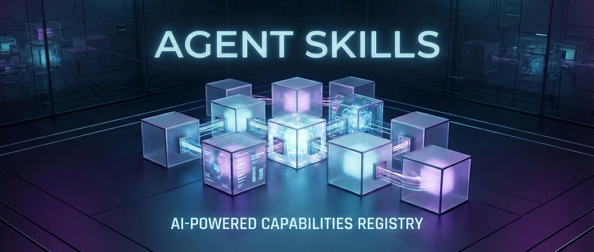

# Awesome DeepAgent Skills



## Contents

- [What Are Agent Skills?](#what-are-agent-skills)
- [Deep Comparison: Agent Skill vs. MCP](#deep-comparison-agent-skill-vs-mcp)
- [Skills](#skills)
  - [Skills Creator](#skills-creator)
  - [Document Skills](#document-skills)
  - [Development & Architecture](#development--architecture)
  - [Data & Analysis](#data--analysis)
  - [Business](#business)
  - [Science & Research](#science--research)
  - [Content & Media](#content--media)
  - [Productivity & Organization](#productivity--organization)
  - [Communication & Writing](#communication--writing)
  - [Collaboration & Project Management](#collaboration--project-management)
  - [Data & AI](#data--ai)
  - [Security & Testing](#security--testing)
- [Getting Started](#getting-started)
- [Using Skills in DeepAgents](#using-skills-in-deepagents)
- [Continual Learning Workflow](#continual-learning-workflow)
- [Creating Skills](#creating-skills)

## What Are Agent Skills?

**Agent Skills** are modular, self-contained packages that extend an AI agent's capabilities with specialized knowledge, workflows, and executable tools.

From a technical perspective, a Skill is not merely a collection of tools; it is a comprehensive aggregate of **"Prompt Engineering + Atomic Tools + Execution Logic."** It defines the **Standard Operating Procedure (SOP)** for how an Agent perceives, reasons, and acts within a specific domain.

While general-purpose LLMs possess abstract reasoning capabilities, Skills transform these into concrete **vertical execution capabilities**. They ensure that when an Agent handles complex tasks, it strictly adheres to pre-defined business rules, constraints, and best practices.

Unlike traditional "tools" which are often hard-coded functions, a Skill is a **standardized file structure** (a folder containing a `SKILL.md` instruction file and optional Python/Bash scripts). This architecture allows agents to:

- **Load on Demand:** using "Progressive Disclosure" to save context tokens by only loading full instructions when necessary.
- **Execute Logic:** run deterministic code (scripts) for complex calculations or file operations instead of relying solely on LLM inference.
- **Persist & Evolve:** create or modify their own skills to adapt to new tasks, effectively forming the agent's "procedural memory."

Think of Skills as **installable plugins** that transform a general-purpose LLM into a domain expert (e.g., a "PDF Expert" or a "Web Scraper").

### Essential Reading

Here are the foundational resources to understand the architecture and potential of Agent Skills:

- **[Equipping Agents for the Real World with Agent Skills](https://www.anthropic.com/engineering/equipping-agents-for-the-real-world-with-agent-skills)** The official engineering blog post from Anthropic. It introduces the Agent Skills standard, explaining the "folder-based" architecture and the concept of **Progressive Disclosure**—how to give agents access to thousands of tools without overwhelming their context window.
- **[Skill Learning: Procedural Memory for Agents](https://www.letta.com/blog/skill-learning)** An insightful article by the Letta team (creators of MemGPT) discussing the concept of **Continuous Learning**. It explores how agents can move from being static "tool users" to dynamic "tool creators" by writing, verifying, and saving their own code as persistent skills.
- **[AgentSkills.io | The Open Standard](https://agentskills.io/home)** The comprehensive documentation hub for the Agent Skills specification. It covers the technical details of the `SKILL.md` format, directory structures, and provides best practices for developers looking to build or validate their own skills.

## Deep Comparison: Agent Skill vs. MCP

In the Agent architecture, **MCP resides in the Infrastructure Layer**, while **Skill resides in the Application Logic Layer**. Both constitute the Agent's action capabilities, but they operate across distinct dimensions.

| **Dimension**           | **Model Context Protocol (MCP)**                             | **Agent Skill**                                              |
| ----------------------- | ------------------------------------------------------------ | ------------------------------------------------------------ |
| **Technical Essence**   | **Connection Protocol & Interface Standard**                 | **Business Logic & Cognitive Encapsulation**                 |
| **Core Problem Solved** | **Interoperability**: Resolves connection barriers between models and heterogeneous data sources/tools, eliminating the "M×N" integration complexity. | **Execution Quality**: Resolves the lack of domain knowledge and standardized processes in general models, ensuring outputs meet specific business standards. |
| **Granularity**         | **Atomic**: Provides fundamental read/write operations (e.g., `read_file`, `exec_sql`, `fetch_url`) without business judgment. | **Composite**: Includes Chain of Thought (CoT), multi-step orchestration, and exception handling (e.g., "Code Review Workflow", "Compliance Check"). |
| **Context Delivery**    | **Passive Supply**: Injects external environmental information (Resources) into the LLM on demand. | **Active Guidance**: Steers LLM behavior patterns via System Prompts. |
| **Applicability**       | Primarily for integrating with external systems              | Web + Desktop + CLI                                          |
| **Loading Strategy**    | Load all tool definitions at startup (may consume more tokens) | On-demand, progressive loading (token-efficient)             |

### When to Use Which?

When architecting an Agent system, follow the layered principle: **"MCP handles connectivity; Skill handles business logic."**

#### When to implement MCP?

Prioritize building or utilizing an **MCP Server** when your requirements involve **system integration** and **data interaction**:

- **Connecting Heterogeneous Data Sources:** When the AI needs to access local file systems, databases (PostgreSQL, Vector DB), or SaaS platforms (Slack, GitHub, Jira).
- **Tool Universalization:** When you want developed tools to be seamlessly callable by different AI clients (e.g., Claude Desktop, Cursor, or proprietary Agent platforms) without binding to a specific model.
- **Environment Isolation & Security:** When you need to expose low-level system interfaces via sandboxing or permission controls, rather than exposing complex API logic directly to the Prompt.

#### When to implement Agent Skill?

Prioritize encapsulating an **Agent Skill** when your requirements involve **task orchestration** and **result control**:

- **Defining Business Workflows:** When tasks must be executed in a strict sequence (e.g., "Retrieve from Knowledge Base -> Logical Validation -> Generate Formatted Report").
- **Domain Expert Mimicry:** When you need to endow the Agent with a specific **Persona** and domain **Context**, making it behave like a Senior Engineer or Legal Advisor.
- **Result Standardization:** When there are strict requirements for output formats (JSON Schema), stylistic tone, or compliance guardrails.
- **Complex Task Encapsulation:** When packaging the logic of calling multiple atomic MCP tools (e.g., `git pull` -> `analysis` -> `git push`) into a single high-level directive.

### Conclusion

- **MCP acts as the "Nerve Endings" of the AI Agent**: It standardizes how the agent perceives and manipulates the digital world, solving the **connectivity** challenge.
- **Skill acts as the "Professional Competence" of the AI Agent**: It solidifies business experience and logical frameworks within specific domains, solving the **efficacy** challenge.

A mature enterprise-grade Agent architecture is inevitably built upon **"extensive connectivity capabilities based on MCP, infused with deep business intelligence through Skills."**

## Skills

### Skills Creator

A foundational "meta-skill" designed to scaffold and generate new Agent Skills. It automates the creation of the standardized directory structure, metadata files (`SKILL.md`), and boilerplate code, enabling agents to efficiently expand their own capabilities and adhere to best practices.

- **[Anthropic Standard (Official)](https://github.com/anthropics/skills/tree/main/skills/skill-creator)** - The reference implementation that defines the industry standard for Agent Skills, serving as the blueprint for `SKILL.md` specifications and general architecture.
- **[DeepAgents Edition](https://github.com/langchain-ai/deepagents/tree/master/libs/deepagents-cli/examples/skills/skill-creator)** - A specialized adaptation for the LangChain DeepAgents framework. It features custom path configurations (`.deepagents/skills`) and validation scripts optimized for the DeepAgents CLI runtime.
- **[Codex-rs Implementation](https://github.com/openai/codex/tree/main/codex-rs/core/src/skills/assets/samples/skill-creator)** - It retains the official packaging workflow but enhances the tooling scripts (adding support for parameters such as `--resources`) and includes an expanded section on detailed naming conventions.

### Document Skills

- [docx](https://github.com/anthropics/skills/tree/main/skills/docx) - Create, edit, analyze Word docs with tracked changes, comments, formatting.
- [pdf](https://github.com/anthropics/skills/tree/main/skills/pdf) - Extract text, tables, metadata, merge & annotate PDFs.
- [pptx](https://github.com/anthropics/skills/tree/main/skills/pptx) - Read, generate, and adjust slides, layouts, templates.
- [xlsx](https://github.com/anthropics/skills/tree/main/skills/xlsx) - Spreadsheet manipulation: formulas, charts, data transformations.
- [Markdown to EPUB Converter](https://github.com/smerchek/claude-epub-skill) - Converts markdown documents and chat summaries into professional EPUB ebook files. 

### Development & Architecture

- [Agent-Skills-for-Context-Engineering](https://github.com/muratcankoylan/Agent-Skills-for-Context-Engineering) - Optimizes agent performance through advanced context engineering techniques, including context compression, degradation prevention, and multi-agent architectural patterns.
- [planning-with-files](https://github.com/OthmanAdi/planning-with-files) - Enables long-horizon task execution by using persistent markdown files (task_plan.md) for state management, progress tracking, and research storage.
- [add-uint-support](https://github.com/pytorch/pytorch/tree/main/.claude/skills/add-uint-support) - Automates the addition of unsigned integer (uint16, uint32, uint64) support to PyTorch operators by updating `AT_DISPATCH` macros to include barebones unsigned types or V2 integral types.
- [tailwind-design-system](https://github.com/wshobson/agents/tree/main/plugins/frontend-mobile-development/skills/tailwind-design-system) - Build scalable design systems with Tailwind CSS, design tokens, component libraries, and responsive patterns. Use when creating component libraries, implementing design systems, or standardizing UI patterns.
- [docstring](https://github.com/pytorch/pytorch/tree/main/.claude/skills/docstring) - Write docstrings for PyTorch functions and methods following PyTorch conventions. Use when writing or updating docstrings in PyTorch code.
- [aws-skills](https://github.com/zxkane/aws-skills) - AWS development with CDK best practices, cost optimization MCP servers, and serverless/event-driven architecture patterns.
- [Changelog Generator](https://github.com/ComposioHQ/awesome-claude-skills/tree/master/changelog-generator) - Automatically creates user-facing changelogs from git commits by analyzing history and transforming technical commits into customer-friendly release notes.
- [Claude Code Terminal Title](https://github.com/bluzername/claude-code-terminal-title) - Gives each Claud-Code terminal window a dynamic title that describes the work being done so you don't lose track of what window is doing what.
- [D3.js Visualization](https://github.com/chrisvoncsefalvay/claude-d3js-skill) - Teaches Claude to produce D3 charts and interactive data visualizations.
- [webapp-testing](https://github.com/anthropics/skills/tree/main/skills/webapp-testing) - Toolkit for interacting with and testing local web applications using Playwright. Supports verifying frontend functionality, debugging UI behavior, capturing browser screenshots, and viewing browser logs.
- [web-artifacts-builder](https://github.com/anthropics/skills/tree/main/skills/web-artifacts-builder) - Suite of tools for creating elaborate, multi-component claude.ai HTML artifacts using modern frontend web technologies (React, Tailwind CSS, shadcn/ui). Use for complex artifacts requiring state management, routing, or shadcn/ui components - not for simple single-file HTML/JSX artifacts.
- [theme-factory](https://github.com/anthropics/skills/tree/main/skills/theme-factory) - Toolkit for styling artifacts with a theme. These artifacts can be slides, docs, reportings, HTML landing pages, etc. There are 10 pre-set themes with colors/fonts that you can apply to any artifact that has been creating, or can generate a new theme on-the-fly.
- [at-dispatch-v2](https://github.com/pytorch/pytorch/blob/main/.claude/skills/at-dispatch-v2/SKILL.md)- Convert PyTorch AT_DISPATCH macros to AT_DISPATCH_V2 format in ATen C++ code. Use when porting AT_DISPATCH_ALL_TYPES_AND*, AT_DISPATCH_FLOATING_TYPES*, or other dispatch macros to the new v2 API. For ATen kernel files, CUDA kernels, and native operator implementations.
- [configured-agent](https://github.com/anthropics/claude-code/tree/main/plugins/plugin-dev/skills/plugin-settings)- This skill should be used when the user asks about "plugin settings", "store plugin configuration", "user-configurable plugin", ".local.md files", "plugin state files", "read YAML frontmatter", "per-project plugin settings", or wants to make plugin behavior configurable. Documents the .claude/plugin-name.local.md pattern for storing plugin-specific configuration with YAML frontmatter and markdown content.
- [skill-development](https://github.com/anthropics/claude-code/tree/main/plugins/plugin-dev/skills/skill-development)- This skill should be used when the user wants to "create a skill", "add a skill to plugin", "write a new skill", "improve skill description", "organize skill content", or needs guidance on skill structure, progressive disclosure, or skill development best practices for Claude Code plugins.
- [FFUF Web Fuzzing](https://github.com/jthack/ffuf_claude_skill) - Integrates the ffuf web fuzzer so Claude can run fuzzing tasks and analyze results for vulnerabilities. *By [@jthack](https://github.com/jthack)*
- [finishing-a-development-branch](https://github.com/obra/superpowers/tree/main/skills/finishing-a-development-branch) - Guides completion of development work by presenting clear options and handling chosen workflow.
- [iOS Simulator](https://github.com/conorluddy/ios-simulator-skill) - Enables Claude to interact with iOS Simulator for testing and debugging iOS applications. *By [@conorluddy](https://github.com/conorluddy)*
- [MCP Builder](./mcp-builder/) - Guides creation of high-quality MCP (Model Context Protocol) servers for integrating external APIs and services with LLMs using Python or TypeScript.
- [ui-uX-pro-max-skill](https://github.com/nextlevelbuilder/ui-ux-pro-max-skill)- UI/UX design intelligence. 50 styles, 21 palettes, 50 font pairings, 20 charts, 8 stacks (React, Next.js, Vue, Svelte, SwiftUI, React Native, Flutter, Tailwind). Actions: plan, build, create, design, implement, review, fix, improve, optimize, enhance, refactor, check UI/UX code. Projects: website, landing page, dashboard, admin panel, e-commerce, SaaS, portfolio, blog, mobile app, .html, .tsx, .vue, .svelte. Elements: button, modal, navbar, sidebar, card, table, form, chart. Styles: glassmorphism, claymorphism, minimalism, brutalism, neumorphism, bento grid, dark mode, responsive, skeuomorphism, flat design. Topics: color palette, accessibility, animation, layout, typography, font pairing, spacing, hover, shadow, gradient.
- [move-code-quality-skill](https://github.com/1NickPappas/move-code-quality-skill) - Analyzes Move language packages against the official Move Book Code Quality Checklist for Move 2024 Edition compliance and best practices.
- [Playwright Browser Automation](https://github.com/lackeyjb/playwright-skill) - Model-invoked Playwright automation for testing and validating web applications. *By [@lackeyjb](https://github.com/lackeyjb)*
- [prompt-engineering](https://github.com/NeoLabHQ/context-engineering-kit/tree/master/plugins/customaize-agent/skills/prompt-engineering) - Teaches well-known prompt engineering techniques and patterns, including Anthropic best practices and agent persuasion principles.
- [pypict-claude-skill](https://github.com/omkamal/pypict-claude-skill) - Design comprehensive test cases using PICT (Pairwise Independent Combinatorial Testing) for requirements or code, generating optimized test suites with pairwise coverage.
- [Skill Seekers](https://github.com/yusufkaraaslan/Skill_Seekers) - Automatically converts any documentation website into a Claude AI skill in minutes.
- [software-architecture](https://github.com/NeoLabHQ/context-engineering-kit/tree/master/plugins/ddd/skills/software-architecture) - Implements design patterns including Clean Architecture, SOLID principles, and comprehensive software design best practices.
- [frontend-design](https://github.com/anthropics/skills/tree/main/skills/frontend-design)- Create distinctive, production-grade frontend interfaces with high design quality. Use this skill when the user asks to build web components, pages, artifacts, posters, or applications (examples include websites, landing pages, dashboards, React components, HTML/CSS layouts, or when styling/beautifying any web UI). Generates creative, polished code and UI design that avoids generic AI aesthetics.
- [subagent-driven-development](https://github.com/NeoLabHQ/context-engineering-kit/tree/master/plugins/sadd/skills/subagent-driven-development) - Dispatches independent subagents for individual tasks with code review checkpoints between iterations for rapid, controlled development.
- [ui-design-system](https://github.com/davila7/claude-code-templates/tree/main/cli-tool/components/skills/creative-design/ui-design-system)- UI design system toolkit for Senior UI Designer including design token generation, component documentation, responsive design calculations, and developer handoff tools. Use for creating design systems, maintaining visual consistency, and facilitating design-dev collaboration.
- [test-driven-development](https://github.com/obra/superpowers/tree/main/skills/test-driven-development) - Use when implementing any feature or bugfix, before writing implementation code.
- [using-git-worktrees](https://github.com/obra/superpowers/blob/main/skills/using-git-worktrees/) - Creates isolated git worktrees with smart directory selection and safety verification.
- [Webapp Testing](./webapp-testing/) - Tests local web applications using Playwright for verifying frontend functionality, debugging UI behavior, and capturing screenshots.

### Data & Analysis

- [CSV Data Summarizer](https://github.com/coffeefuelbump/csv-data-summarizer-claude-skill) - Instantly transforms raw CSV files into comprehensive reports and visualizations with zero-shot configuration. 
- [sql-optimization-patterns](https://github.com/wshobson/agents/tree/main/plugins/developer-essentials/skills/sql-optimization-patterns) - Master SQL query optimization, indexing strategies, and EXPLAIN analysis to dramatically improve database performance and eliminate slow queries. Use when debugging slow queries, designing database schemas, or optimizing application performance.
- [database-migration](https://github.com/wshobson/agents/tree/main/plugins/framework-migration/skills/database-migration) - Execute database migrations across ORMs and platforms with zero-downtime strategies, data transformation, and rollback procedures. Use when migrating databases, changing schemas, performing data transformations, or implementing zero-downtime deployment strategies.
- [postgres](https://github.com/sanjay3290/ai-skills/tree/main/skills/postgres) - Performs safe, read-only SQL operations across multiple PostgreSQL connections with built-in defense-in-depth protocols. 
- [postgres-schema-design](https://github.com/davila7/claude-code-templates/tree/main/cli-tool/components/skills/database/postgres-schema-design) - Comprehensive PostgreSQL-specific table design reference covering data types, indexing, constraints, performance patterns, and advanced features
- [root-cause-tracing](https://github.com/obra/superpowers/tree/main/skills/root-cause-tracing) - Systematically traces deep execution failures backward through the stack to pinpoint the specific origin of complex errors.
- [create-database-migration](https://github.com/TryGhost/Ghost/tree/main/.claude/skills/create-database-migration) - Create a database migration to add a table, add columns to an existing table, add a setting, or otherwise change the schema of Ghost's MySQL database.
- [db-migrations-schema-changes](https://github.com/letta-ai/letta/tree/main/.skills/db-migrations-schema-changes) - Workflows and commands for managing Alembic database migrations and schema changes in the letta-cloud core app, including using uv, just, LETTA_PG_URI, and switching between SQLite and Postgres.

### Business

- [Brand Guidelines](https://github.com/ComposioHQ/awesome-claude-skills/tree/master/brand-guidelines) - Applies Anthropic's official brand colors and typography to artifacts for consistent visual identity and professional design standards.
- [analyzing-financial-statements](https://github.com/anthropics/claude-cookbooks/tree/main/skills/custom_skills/analyzing-financial-statements) - This skill calculates key financial ratios and metrics from financial statement data for investment analysis
- [creating-financial-models](https://github.com/anthropics/claude-cookbooks/tree/main/skills/custom_skills/creating-financial-models) - This skill provides an advanced financial modeling suite with DCF analysis, sensitivity testing, Monte Carlo simulations, and scenario planning for investment decisions
- [applying-brand-guidelines](https://github.com/anthropics/claude-cookbooks/tree/main/skills/custom_skills/applying-brand-guidelines) - This skill applies consistent corporate branding and styling to all generated documents including colors, fonts, layouts, and messaging
- [Competitive Ads Extractor](https://github.com/ComposioHQ/awesome-claude-skills/tree/master/competitive-ads-extractor) - Extracts and analyzes competitors' ads from ad libraries to understand messaging and creative approaches that resonate.
- [Domain Name Brainstormer](https://github.com/ComposioHQ/awesome-claude-skills/tree/master/domain-name-brainstormer) - Generates creative domain name ideas and checks availability across multiple TLDs including .com, .io, .dev, and .ai extensions.
- [billing-automation](https://github.com/wshobson/agents/tree/main/plugins/payment-processing/skills/billing-automation) - Build automated billing systems for recurring payments, invoicing, subscription lifecycle, and dunning management. Use when implementing subscription billing, automating invoicing, or managing recurring payment systems.
- [data-storytelling](https://github.com/wshobson/agents/tree/main/plugins/business-analytics/skills/data-storytelling) - Transform data into compelling narratives using visualization, context, and persuasive structure. Use when presenting analytics to stakeholders, creating data reports, or building executive presentations.
- [Internal Comms](https://github.com/ComposioHQ/awesome-claude-skills/tree/master/internal-comms) - Helps write internal communications including 3P updates, company newsletters, FAQs, status reports, and project updates using company-specific formats.
- [Lead Research Assistant](https://github.com/ComposioHQ/awesome-claude-skills/tree/master/lead-research-assistant) - Identifies and qualifies high-quality leads by analyzing your product, searching for target companies, and providing actionable outreach strategies.
- [marketing-demand-acquisition](https://github.com/davila7/claude-code-templates/blob/main/cli-tool/components/skills/business-marketing/marketing-demand-acquisition/SKILL.md) - Multi-channel demand generation, paid media optimization, SEO strategy, and partnership programs for Series A+ startups. Includes CAC calculator, channel playbooks, HubSpot integration, and international expansion tactics. Use when planning demand generation campaigns, optimizing paid media, building SEO strategies, establishing partnerships, or when user mentions demand gen, paid ads, LinkedIn ads, Google ads, CAC, acquisition, lead generation, or pipeline generation.
- [marketing-strategy-pmm](https://github.com/davila7/claude-code-templates/blob/main/cli-tool/components/skills/business-marketing/marketing-strategy-pmm/SKILL.md) - Product marketing, positioning, GTM strategy, and competitive intelligence. Includes ICP definition, April Dunford positioning methodology, launch playbooks, competitive battlecards, and international market entry guides. Use when developing positioning, planning product launches, creating messaging, analyzing competitors, entering new markets, enabling sales, or when user mentions product marketing, positioning, GTM, go-to-market, competitive analysis, market entry, or sales enablement.
- [product-manager-toolkit](https://github.com/davila7/claude-code-templates/blob/main/cli-tool/components/skills/business-marketing/product-manager-toolkit/SKILL.md) - Comprehensive toolkit for product managers including RICE prioritization, customer interview analysis, PRD templates, discovery frameworks, and go-to-market strategies. Use for feature prioritization, user research synthesis, requirement documentation, and product strategy development.
- [product-strategist](https://github.com/davila7/claude-code-templates/blob/main/cli-tool/components/skills/business-marketing/product-strategist/SKILL.md) - Strategic product leadership toolkit for Head of Product including OKR cascade generation, market analysis, vision setting, and team scaling. Use for strategic planning, goal alignment, competitive analysis, and organizational design.
- [lead-research-assistant](https://github.com/davila7/claude-code-templates/blob/main/cli-tool/components/skills/business-marketing/lead-research-assistant/SKILL.md) - Identifies high-quality leads for your product or service by analyzing your business, searching for target companies, and providing actionable contact strategies. Perfect for sales, business development, and marketing professionals.
- [cto-advisor](https://github.com/davila7/claude-code-templates/blob/main/cli-tool/components/skills/business-marketing/cto-advisor/SKILL.md) - Technical leadership guidance for engineering teams, architecture decisions, and technology strategy. Includes tech debt analyzer, team scaling calculator, engineering metrics frameworks, technology evaluation tools, and ADR templates. Use when assessing technical debt, scaling engineering teams, evaluating technologies, making architecture decisions, establishing engineering metrics, or when user mentions CTO, tech debt, technical debt, team scaling, architecture decisions, technology evaluation, engineering metrics, DORA metrics, or technology strategy.
- [content-research-writer](https://github.com/davila7/claude-code-templates/blob/main/cli-tool/components/skills/business-marketing/content-research-writer/SKILL.md) - Assists in writing high-quality content by conducting research, adding citations, improving hooks, iterating on outlines, and providing real-time feedback on each section. Transforms your writing process from solo effort to collaborative partnership.
- [content-creator](https://github.com/davila7/claude-code-templates/blob/main/cli-tool/components/skills/business-marketing/content-creator/SKILL.md) - Create SEO-optimized marketing content with consistent brand voice. Includes brand voice analyzer, SEO optimizer, content frameworks, and social media templates. Use when writing blog posts, creating social media content, analyzing brand voice, optimizing SEO, planning content calendars, or when user mentions content creation, brand voice, SEO optimization, social media marketing, or content strategy.

### Science & Research

- [attack-tree-construction](https://github.com/wshobson/agents/tree/main/plugins/security-scanning/skills/attack-tree-construction) - Build comprehensive attack trees to visualize threat paths. Use when mapping attack scenarios, identifying defense gaps, or communicating security risks to stakeholders.
- [scientific-critical-thinking](https://github.com/davila7/claude-code-templates/blob/main/cli-tool/components/skills/scientific/scientific-critical-thinking/SKILL.md) - Evaluate research rigor. Assess methodology, experimental design, statistical validity, biases, confounding, evidence quality (GRADE, Cochrane ROB), for critical analysis of scientific claims.
- [literature-review](https://github.com/davila7/claude-code-templates/blob/main/cli-tool/components/skills/scientific/literature-review/SKILL.md) - Conduct comprehensive, systematic literature reviews using multiple academic databases (PubMed, arXiv, bioRxiv, Semantic Scholar, etc.). This skill should be used when conducting systematic literature reviews, meta-analyses, research synthesis, or comprehensive literature searches across biomedical, scientific, and technical domains. Creates professionally formatted markdown documents and PDFs with verified citations in multiple citation styles (APA, Nature, Vancouver, etc.).
- [peer-review](https://github.com/davila7/claude-code-templates/blob/main/cli-tool/components/skills/scientific/peer-review/SKILL.md) - Systematic peer review toolkit. Evaluate methodology, statistics, design, reproducibility, ethics, figure integrity, reporting standards, for manuscript and grant review across disciplines.
- [generate-image](https://github.com/davila7/claude-code-templates/blob/main/cli-tool/components/skills/scientific/generate-image/SKILL.md) - Generate or edit images using AI models (FLUX, Gemini). Use for general-purpose image generation including photos, illustrations, artwork, visual assets, concept art, and any image that isn't a technical diagram or schematic. For flowcharts, circuits, pathways, and technical diagrams, use the scientific-schematics skill instead.
- [adaptyv](https://github.com/davila7/claude-code-templates/blob/main/cli-tool/components/skills/scientific/adaptyv/SKILL.md) - Cloud laboratory platform for automated protein testing and validation. Use when designing proteins and needing experimental validation including binding assays, expression testing, thermostability measurements, enzyme activity assays, or protein sequence optimization. Also use for submitting experiments via API, tracking experiment status, downloading results, optimizing protein sequences for better expression using computational tools (NetSolP, SoluProt, SolubleMPNN, ESM), or managing protein design workflows with wet-lab validation.
- [alphafold-database](https://github.com/davila7/claude-code-templates/blob/main/cli-tool/components/skills/scientific/alphafold-database/SKILL.md) - Access AlphaFold's 200M+ AI-predicted protein structures. Retrieve structures by UniProt ID, download PDB/mmCIF files, analyze confidence metrics (pLDDT, PAE), for drug discovery and structural biology.
- [anndata](https://github.com/davila7/claude-code-templates/blob/main/cli-tool/components/skills/scientific/anndata/SKILL.md) - This skill should be used when working with annotated data matrices in Python, particularly for single-cell genomics analysis, managing experimental measurements with metadata, or handling large-scale biological datasets. Use when tasks involve AnnData objects, h5ad files, single-cell RNA-seq data, or integration with scanpy/scverse tools.
- [benchling-integration](https://github.com/davila7/claude-code-templates/blob/main/cli-tool/components/skills/scientific/benchling-integration/SKILL.md) - Benchling R&D platform integration. Access registry (DNA, proteins), inventory, ELN entries, workflows via API, build Benchling Apps, query Data Warehouse, for lab data management automation.
- [biomni](https://github.com/davila7/claude-code-templates/blob/main/cli-tool/components/skills/scientific/biomni/SKILL.md) - Autonomous biomedical AI agent framework for executing complex research tasks across genomics, drug discovery, molecular biology, and clinical analysis. Use this skill when conducting multi-step biomedical research including CRISPR screening design, single-cell RNA-seq analysis, ADMET prediction, GWAS interpretation, rare disease diagnosis, or lab protocol optimization. Leverages LLM reasoning with code execution and integrated biomedical databases.
- [biorxiv-database](https://github.com/davila7/claude-code-templates/blob/main/cli-tool/components/skills/scientific/biorxiv-database/SKILL.md) - Efficient database search tool for bioRxiv preprint server. Use this skill when searching for life sciences preprints by keywords, authors, date ranges, or categories, retrieving paper metadata, downloading PDFs, or conducting literature reviews.
- [cellxgene-census](https://github.com/davila7/claude-code-templates/blob/main/cli-tool/components/skills/scientific/cellxgene-census/SKILL.md) - Query CZ CELLxGENE Census (61M+ cells). Filter by cell type/tissue/disease, retrieve expression data, integrate with scanpy/PyTorch, for population-scale single-cell analysis.
- [chembl-database](https://github.com/davila7/claude-code-templates/blob/main/cli-tool/components/skills/scientific/chembl-database/SKILL.md) - Query ChEMBL's bioactive molecules and drug discovery data. Search compounds by structure/properties, retrieve bioactivity data (IC50, Ki), find inhibitors, perform SAR studies, for medicinal chemistry.
- [citation-management](https://github.com/davila7/claude-code-templates/blob/main/cli-tool/components/skills/scientific/citation-management/SKILL.md) - Comprehensive citation management for academic research. Search Google Scholar and PubMed for papers, extract accurate metadata, validate citations, and generate properly formatted BibTeX entries. This skill should be used when you need to find papers, verify citation information, convert DOIs to BibTeX, or ensure reference accuracy in scientific writing.
- [clinical-decision-support](https://github.com/davila7/claude-code-templates/blob/main/cli-tool/components/skills/scientific/clinical-decision-support/SKILL.md) - Generate professional clinical decision support (CDS) documents for pharmaceutical and clinical research settings, including patient cohort analyses (biomarker-stratified with outcomes) and treatment recommendation reports (evidence-based guidelines with decision algorithms). Supports GRADE evidence grading, statistical analysis (hazard ratios, survival curves, waterfall plots), biomarker integration, and regulatory compliance. Outputs publication-ready LaTeX/PDF format optimized for drug development, clinical research, and evidence synthesis.
- [cobrapy](https://github.com/davila7/claude-code-templates/blob/main/cli-tool/components/skills/scientific/cobrapy/SKILL.md) - Constraint-based metabolic modeling (COBRA). FBA, FVA, gene knockouts, flux sampling, SBML models, for systems biology and metabolic engineering analysis.
- [datamol](https://github.com/davila7/claude-code-templates/blob/main/cli-tool/components/skills/scientific/datamol/SKILL.md) - Pythonic wrapper around RDKit with simplified interface and sensible defaults. Preferred for standard drug discovery: SMILES parsing, standardization, descriptors, fingerprints, clustering, 3D conformers, parallel processing. Returns native rdkit.Chem.Mol objects. For advanced control or custom parameters, use rdkit directly.
- [drugbank-database](https://github.com/davila7/claude-code-templates/blob/main/cli-tool/components/skills/scientific/drugbank-database/SKILL.md) - Access and analyze comprehensive drug information from the DrugBank database including drug properties, interactions, targets, pathways, chemical structures, and pharmacology data. This skill should be used when working with pharmaceutical data, drug discovery research, pharmacology studies, drug-drug interaction analysis, target identification, chemical similarity searches, ADMET predictions, or any task requiring detailed drug and drug target information from DrugBank.
- [fda-database](https://github.com/davila7/claude-code-templates/blob/main/cli-tool/components/skills/scientific/fda-database/SKILL.md) - Query openFDA API for drugs, devices, adverse events, recalls, regulatory submissions (510k, PMA), substance identification (UNII), for FDA regulatory data analysis and safety research.
- [fluidsim](https://github.com/davila7/claude-code-templates/blob/main/cli-tool/components/skills/scientific/fluidsim/SKILL.md) - Framework for computational fluid dynamics simulations using Python. Use when running fluid dynamics simulations including Navier-Stokes equations (2D/3D), shallow water equations, stratified flows, or when analyzing turbulence, vortex dynamics, or geophysical flows. Provides pseudospectral methods with FFT, HPC support, and comprehensive output analysis.
- [generate-image](https://github.com/davila7/claude-code-templates/blob/main/cli-tool/components/skills/scientific/generate-image/SKILL.md) - Generate or edit images using AI models (FLUX, Gemini). Use for general-purpose image generation including photos, illustrations, artwork, visual assets, concept art, and any image that isn't a technical diagram or schematic. For flowcharts, circuits, pathways, and technical diagrams, use the scientific-schematics skill instead.
- [geniml](https://github.com/davila7/claude-code-templates/blob/main/cli-tool/components/skills/scientific/geniml/SKILL.md) - This skill should be used when working with genomic interval data (BED files) for machine learning tasks. Use for training region embeddings (Region2Vec, BEDspace), single-cell ATAC-seq analysis (scEmbed), building consensus peaks (universes), or any ML-based analysis of genomic regions. Applies to BED file collections, scATAC-seq data, chromatin accessibility datasets, and region-based genomic feature learning.
- [geo-database](https://github.com/davila7/claude-code-templates/blob/main/cli-tool/components/skills/scientific/geo-database/SKILL.md) - Access NCBI GEO for gene expression/genomics data. Search/download microarray and RNA-seq datasets (GSE, GSM, GPL), retrieve SOFT/Matrix files, for transcriptomics and expression analysis.
- [gget](https://github.com/davila7/claude-code-templates/blob/main/cli-tool/components/skills/scientific/gget/SKILL.md) - CLI/Python toolkit for rapid bioinformatics queries. Preferred for quick BLAST searches. Access to 20+ databases: gene info (Ensembl/UniProt), AlphaFold, ARCHS4, Enrichr, OpenTargets, COSMIC, genome downloads. For advanced BLAST/batch processing, use biopython. For multi-database integration, use bioservices.
- [hypogenic](https://github.com/davila7/claude-code-templates/blob/main/cli-tool/components/skills/scientific/hypogenic/SKILL.md) - Automated hypothesis generation and testing using large language models. Use this skill when generating scientific hypotheses from datasets, combining literature insights with empirical data, testing hypotheses against observational data, or conducting systematic hypothesis exploration for research discovery in domains like deception detection, AI content detection, mental health analysis, or other empirical research tasks.
- [labarchive-integration](https://github.com/davila7/claude-code-templates/blob/main/cli-tool/components/skills/scientific/labarchive-integration/SKILL.md) - Electronic lab notebook API integration. Access notebooks, manage entries/attachments, backup notebooks, integrate with Protocols.io/Jupyter/REDCap, for programmatic ELN workflows.
- [latex-posters](https://github.com/davila7/claude-code-templates/blob/main/cli-tool/components/skills/scientific/latex-posters/SKILL.md) - Create professional research posters in LaTeX using beamerposter, tikzposter, or baposter. Support for conference presentations, academic posters, and scientific communication. Includes layout design, color schemes, multi-column formats, figure integration, and poster-specific best practices for visual communication.
- [literature-review](https://github.com/davila7/claude-code-templates/blob/main/cli-tool/components/skills/scientific/literature-review/SKILL.md) - Conduct comprehensive, systematic literature reviews using multiple academic databases (PubMed, arXiv, bioRxiv, Semantic Scholar, etc.). This skill should be used when conducting systematic literature reviews, meta-analyses, research synthesis, or comprehensive literature searches across biomedical, scientific, and technical domains. Creates professionally formatted markdown documents and PDFs with verified citations in multiple citation styles (APA, Nature, Vancouver, etc.).
- [matplotlib](https://github.com/davila7/claude-code-templates/blob/main/cli-tool/components/skills/scientific/matplotlib/SKILL.md) - Foundational plotting library. Create line plots, scatter, bar, histograms, heatmaps, 3D, subplots, export PNG/PDF/SVG, for scientific visualization and publication figures.
- [networkx](https://github.com/davila7/claude-code-templates/blob/main/cli-tool/components/skills/scientific/networkx/SKILL.md) - Comprehensive toolkit for creating, analyzing, and visualizing complex networks and graphs in Python. Use when working with network/graph data structures, analyzing relationships between entities, computing graph algorithms (shortest paths, centrality, clustering), detecting communities, generating synthetic networks, or visualizing network topologies. Applicable to social networks, biological networks, transportation systems, citation networks, and any domain involving pairwise relationships.
- [paper-2-web](https://github.com/davila7/claude-code-templates/blob/main/cli-tool/components/skills/scientific/paper-2-web/SKILL.md) - This skill should be used when converting academic papers into promotional and presentation formats including interactive websites (Paper2Web), presentation videos (Paper2Video), and conference posters (Paper2Poster). Use this skill for tasks involving paper dissemination, conference preparation, creating explorable academic homepages, generating video abstracts, or producing print-ready posters from LaTeX or PDF sources.
- [latex-posters](https://github.com/davila7/claude-code-templates/blob/main/cli-tool/components/skills/scientific/pptx-posters/SKILL.md) - Create professional research posters in LaTeX using beamerposter, tikzposter, or baposter. Support for conference presentations, academic posters, and scientific communication. Includes layout design, color schemes, multi-column formats, figure integration, and poster-specific best practices for visual communication.
- [pytorch-lightning](https://github.com/davila7/claude-code-templates/blob/main/cli-tool/components/skills/scientific/pytorch-lightning/SKILL.md) - Deep learning framework (PyTorch Lightning). Organize PyTorch code into LightningModules, configure Trainers for multi-GPU/TPU, implement data pipelines, callbacks, logging (W&B, TensorBoard), distributed training (DDP, FSDP, DeepSpeed), for scalable neural network training.
- [scanpy](https://github.com/davila7/claude-code-templates/blob/main/cli-tool/components/skills/scientific/scanpy/SKILL.md) - Single-cell RNA-seq analysis. Load .h5ad/10X data, QC, normalization, PCA/UMAP/t-SNE, Leiden clustering, marker genes, cell type annotation, trajectory, for scRNA-seq analysis.
- [scvi-tools](https://github.com/davila7/claude-code-templates/blob/main/cli-tool/components/skills/scientific/scvi-tools/SKILL.md) - This skill should be used when working with single-cell omics data analysis using scvi-tools, including scRNA-seq, scATAC-seq, CITE-seq, spatial transcriptomics, and other single-cell modalities. Use this skill for probabilistic modeling, batch correction, dimensionality reduction, differential expression, cell type annotation, multimodal integration, and spatial analysis tasks.
- [torch-geometric](https://github.com/davila7/claude-code-templates/blob/main/cli-tool/components/skills/scientific/torch_geometric/SKILL.md) - Graph Neural Networks (PyG). Node/graph classification, link prediction, GCN, GAT, GraphSAGE, heterogeneous graphs, molecular property prediction, for geometric deep learning.
- [transformers](https://github.com/davila7/claude-code-templates/blob/main/cli-tool/components/skills/scientific/transformers/SKILL.md) - This skill should be used when working with pre-trained transformer models for natural language processing, computer vision, audio, or multimodal tasks. Use for text generation, classification, question answering, translation, summarization, image classification, object detection, speech recognition, and fine-tuning models on custom datasets.
- [hybrid-search-implementation](https://github.com/wshobson/agents/tree/main/plugins/llm-application-dev/skills/hybrid-search-implementation) - Combine vector and keyword search for improved retrieval. Use when implementing RAG systems, building search engines, or when neither approach alone provides sufficient recall.
- [content-research-writer](https://github.com/ComposioHQ/awesome-claude-skills/tree/master/content-research-writer) - Assists in writing high-quality content by conducting research, adding citations, improving hooks, iterating on outlines, and providing real-time feedback on each section. Transforms your writing process from solo effort to collaborative partnership.
- [cellxgene-census](https://github.com/davila7/claude-code-templates/tree/main/cli-tool/components/skills/scientific/cellxgene-census) - Query CZ CELLxGENE Census (61M+ cells). Filter by cell type/tissue/disease, retrieve expression data, integrate with scanpy/PyTorch, for population-scale single-cell analysis.
- [arboreto](https://github.com/davila7/claude-code-templates/tree/main/cli-tool/components/skills/scientific/arboreto) - Infer gene regulatory networks (GRNs) from gene expression data using scalable algorithms (GRNBoost2, GENIE3). Use when analyzing transcriptomics data (bulk RNA-seq, single-cell RNA-seq) to identify transcription factor-target gene relationships and regulatory interactions. Supports distributed computation for large-scale datasets.
- [pyopenms](https://github.com/davila7/claude-code-templates/tree/main/cli-tool/components/skills/scientific/pyopenms) - Python interface to OpenMS for mass spectrometry data analysis. Use for LC-MS/MS proteomics and metabolomics workflows including file handling (mzML, mzXML, mzTab, FASTA, pepXML, protXML, mzIdentML), signal processing, feature detection, peptide identification, and quantitative analysis. Apply when working with mass spectrometry data, analyzing proteomics experiments, or processing metabolomics datasets.
- [denario](https://github.com/davila7/claude-code-templates/tree/main/cli-tool/components/skills/scientific/denario) - Multiagent AI system for scientific research assistance that automates research workflows from data analysis to publication. This skill should be used when generating research ideas from datasets, developing research methodologies, executing computational experiments, performing literature searches, or generating publication-ready papers in LaTeX format. Supports end-to-end research pipelines with customizable agent orchestration.

### Content & Media

- [seo-review](https://github.com/leonardomso/33-js-concepts/tree/master/.opencode/skill/seo-review) - Perform a focused SEO audit on JavaScript concept pages to maximize search visibility, featured snippet optimization, and ranking potential
- [Canvas Design](https://github.com/ComposioHQ/awesome-claude-skills/tree/master/canvas-design) - Creates beautiful visual art in PNG and PDF documents using design philosophy and aesthetic principles for posters, designs, and static pieces.
- [imagen](https://github.com/sanjay3290/ai-skills/tree/main/skills/imagen) - Generate images using Google Gemini's image generation API for UI mockups, icons, illustrations, and visual assets. 
- [frontend-design](https://github.com/anthropics/skills/tree/main/skills/frontend-design) - Create distinctive, production-grade frontend interfaces with high design quality. Use this skill when the user asks to build web components, pages, artifacts, posters, or applications (examples include websites, landing pages, dashboards, React components, HTML/CSS layouts, or when styling/beautifying any web UI). Generates creative, polished code and UI design that avoids generic AI aesthetics.
- [Image Enhancer](https://github.com/ComposioHQ/awesome-claude-skills/tree/master/image-enhancer) - Improves image and screenshot quality by enhancing resolution, sharpness, and clarity for professional presentations and documentation.
- [Slack GIF Creator](https://github.com/ComposioHQ/awesome-claude-skills/tree/master/slack-gif-creator) - Creates animated GIFs optimized for Slack with validators for size constraints and composable animation primitives.
- [algorithmic-art](https://github.com/anthropics/skills/tree/main/skills/algorithmic-art) - Creating algorithmic art using p5.js with seeded randomness and interactive parameter exploration. Use this when users request creating art using code, generative art, algorithmic art, flow fields, or particle systems. Create original algorithmic art rather than copying existing artists' work to avoid copyright violations.
- [Theme Factory](https://github.com/ComposioHQ/awesome-claude-skills/tree/master/theme-factory) - Applies professional font and color themes to artifacts including slides, docs, reports, and HTML landing pages with 10 pre-set themes.
- [slack-gif-creator](https://github.com/anthropics/skills/tree/main/skills/slack-gif-creator) - Knowledge and utilities for creating animated GIFs optimized for Slack. Provides constraints, validation tools, and animation concepts. Use when users request animated GIFs for Slack like "make me a GIF of X doing Y for Slack."
- [Video Downloader](https://github.com/ComposioHQ/awesome-claude-skills/tree/master/video-downloader) - Downloads videos from YouTube and other platforms for offline viewing, editing, or archival with support for various formats and quality options.
- [youtube-transcript](https://github.com/michalparkola/tapestry-skills-for-claude-code/tree/main/youtube-transcript) - Fetch transcripts from YouTube videos and prepare summaries.

### Productivity & Organization

- [File Organizer](https://github.com/ComposioHQ/awesome-claude-skills/tree/master/file-organizer) - Intelligently organizes files and folders by understanding context, finding duplicates, and suggesting better organizational structures.
- [Invoice Organizer](https://github.com/ComposioHQ/awesome-claude-skills/tree/master/invoice-organizer) - Automatically organizes invoices and receipts for tax preparation by reading files, extracting information, and renaming consistently.
- [kaizen](https://github.com/NeoLabHQ/context-engineering-kit/tree/master/plugins/kaizen/skills/kaizen) - Applies continuous improvement methodology with multiple analytical approaches, based on Japanese Kaizen philosophy and Lean methodology.
- [n8n-skills](https://github.com/haunchen/n8n-skills) - Enables AI assistants to directly understand and operate n8n workflows.
- [Raffle Winner Picker](https://github.com/ComposioHQ/awesome-claude-skills/tree/master/raffle-winner-picker) - Randomly selects winners from lists, spreadsheets, or Google Sheets for giveaways and contests with cryptographically secure randomness.
- [ship-learn-next](https://github.com/michalparkola/tapestry-skills-for-claude-code/tree/main/ship-learn-next) - Skill to help iterate on what to build or learn next, based on feedback loops.
- [tapestry](https://github.com/michalparkola/tapestry-skills-for-claude-code/tree/main/tapestry) - Interlink and summarize related documents into knowledge networks.

### Communication & Writing

- [article-extractor](https://github.com/michalparkola/tapestry-skills-for-claude-code/tree/main/article-extractor) - Extract full article text and metadata from web pages.
- [brainstorming](https://github.com/obra/superpowers/tree/main/skills/brainstorming) - Transform rough ideas into fully-formed designs through structured questioning and alternative exploration.
- [Content Research Writer](https://github.com/ComposioHQ/awesome-claude-skills/tree/master/content-research-writer) - Assists in writing high-quality content by conducting research, adding citations, improving hooks, and providing section-by-section feedback.
- [family-history-research](https://github.com/emaynard/claude-family-history-research-skill) - Provides assistance with planning family history and genealogy research projects.
- [Meeting Insights Analyzer](https://github.com/ComposioHQ/awesome-claude-skills/tree/master/meeting-insights-analyzer) - Analyzes meeting transcripts to uncover behavioral patterns including conflict avoidance, speaking ratios, filler words, and leadership style.
- [NotebookLM Integration](https://github.com/PleasePrompto/notebooklm-skill) - Lets Claude Code chat directly with NotebookLM for source-grounded answers based exclusively on uploaded documents. *By [@PleasePrompto](https://github.com/PleasePrompto)*

### Collaboration & Project Management

- [git-pushing](https://github.com/mhattingpete/claude-skills-marketplace/tree/main/engineering-workflow-plugin/skills/git-pushing) - Automate git operations and repository interactions.
- [electron-chromium-upgrade](https://github.com/electron/electron/tree/main/.claude/skills/electron-chromium-upgrade) - Guide for performing Chromium version upgrades in the Electron project. Use when working on the roller/chromium/main branch to fix patch conflicts during `e sync --3`. Covers the patch application workflow, conflict resolution, analyzing upstream Chromium changes, and proper commit formatting for patch fixes.
- [code-review](https://github.com/agno-agi/agno/tree/main/cookbook/03_agents/skills/sample_skills/code-review) - Code review assistance with linting, style checking, and best practices
- [review-implementing](https://github.com/mhattingpete/claude-skills-marketplace/tree/main/engineering-workflow-plugin/skills/review-implementing) - Evaluate code implementation plans and align with specs.
- [git-workflow](https://github.com/agno-agi/agno/tree/main/cookbook/03_agents/skills/sample_skills/git-workflow) - Git workflow guidance for commits, branches, and pull requests
- [backport-pr-assistant](https://github.com/cockroachdb/cockroach/tree/master/.claude/skills/backport-pr-assistant) - Help backport PRs to release branches using the backport CLI tool. Use when backporting changes that have merge conflicts requiring manual resolution.
- [git-advanced-workflows](https://github.com/wshobson/agents/tree/main/plugins/developer-essentials/skills/git-advanced-workflows) - Master advanced Git workflows including rebasing, cherry-picking, bisect, worktrees, and reflog to maintain clean history and recover from any situation. Use when managing complex Git histories, collaborating on feature branches, or troubleshooting repository issues.
- [terraform-module-library](https://github.com/wshobson/agents/tree/main/plugins/cloud-infrastructure/skills/terraform-module-library) - Build reusable Terraform modules for AWS, Azure, and GCP infrastructure following infrastructure-as-code best practices. Use when creating infrastructure modules, standardizing cloud provisioning, or implementing reusable IaC components.
- [test-fixing](https://github.com/mhattingpete/claude-skills-marketplace/tree/main/engineering-workflow-plugin/skills/test-fixing) - Detect failing tests and propose patches or fixes.

### Data &AI

- [plugin-structure](https://github.com/anthropics/claude-code/tree/main/plugins/plugin-dev/skills/plugin-structure) - This skill should be used when the user asks to "create a plugin", "scaffold a plugin", "understand plugin structure", "organize plugin components", "set up plugin.json", "use ${CLAUDE_PLUGIN_ROOT}", "add commands/agents/skills/hooks", "configure auto-discovery", or needs guidance on plugin directory layout, manifest configuration, component organization, file naming conventions, or Claude Code plugin architecture best practices.
- [command-development](https://github.com/anthropics/claude-code/tree/main/plugins/plugin-dev/skills/command-development) - This skill should be used when the user asks to "create a slash command", "add a command", "write a custom command", "define command arguments", "use command frontmatter", "organize commands", "create command with file references", "interactive command", "use AskUserQuestion in command", or needs guidance on slash command structure, YAML frontmatter fields, dynamic arguments, bash execution in commands, user interaction patterns, or command development best practices for Claude Code.
- [agent-development](https://github.com/anthropics/claude-code/tree/main/plugins/plugin-dev/skills/agent-development) - This skill should be used when the user asks to "create an agent", "add an agent", "write a subagent", "agent frontmatter", "when to use description", "agent examples", "agent tools", "agent colors", "autonomous agent", or needs guidance on agent structure, system prompts, triggering conditions, or agent development best practices for Claude Code plugins.
- [mcp-integration](https://github.com/anthropics/claude-code/tree/main/plugins/plugin-dev/skills/mcp-integration) - This skill should be used when the user asks to "add MCP server", "integrate MCP", "configure MCP in plugin", "use .mcp.json", "set up Model Context Protocol", "connect external service", mentions "${CLAUDE_PLUGIN_ROOT} with MCP", or discusses MCP server types (SSE, stdio, HTTP, WebSocket). Provides comprehensive guidance for integrating Model Context Protocol servers into Claude Code plugins for external tool and service integration.
- [hook-development](https://github.com/anthropics/claude-code/tree/main/plugins/plugin-dev/skills/hook-development) - This skill should be used when the user asks to "create a hook", "add a PreToolUse/PostToolUse/Stop hook", "validate tool use", "implement prompt-based hooks", "use ${CLAUDE_PLUGIN_ROOT}", "set up event-driven automation", "block dangerous commands", or mentions hook events (PreToolUse, PostToolUse, Stop, SubagentStop, SessionStart, SessionEnd, UserPromptSubmit, PreCompact, Notification). Provides comprehensive guidance for creating and implementing Claude Code plugin hooks with focus on advanced prompt-based hooks API.
- [cookbook-audit](https://github.com/anthropics/claude-cookbooks/tree/main/.claude/skills/cookbook-audit) - Audit an Anthropic Cookbook notebook based on a rubric. Use whenever a notebook review or audit is requested.
- [rag-implementation](https://github.com/wshobson/agents/tree/main/plugins/llm-application-dev/skills/rag-implementation) - Build Retrieval-Augmented Generation (RAG) systems for LLM applications with vector databases and semantic search. Use when implementing knowledge-grounded AI, building document Q&A systems, or integrating LLMs with external knowledge bases.

### Security & Testing

- [computer-forensics](https://github.com/mhattingpete/claude-skills-marketplace/tree/main/computer-forensics-skills/skills/computer-forensics) - Digital forensics analysis and investigation techniques.
- [frontend-code-review](https://github.com/langgenius/dify/tree/main/.claude/skills/frontend-code-review) - Trigger when the user requests a review of frontend files (e.g., `.tsx`, `.ts`, `.js`). Support both pending-change reviews and focused file reviews while applying the checklist rules.
- [file-deletion](https://github.com/mhattingpete/claude-skills-marketplace/tree/main/computer-forensics-skills/skills/file-deletion) - Secure file deletion and data sanitization methods.
- [frontend-testing](https://github.com/langgenius/dify/tree/main/.claude/skills/frontend-testing) - Generate Vitest + React Testing Library tests for Dify frontend components, hooks, and utilities. Triggers on testing, spec files, coverage, Vitest, RTL, unit tests, integration tests, or write/review test requests.
- [component-refactoring](https://github.com/langgenius/dify/tree/main/.claude/skills/component-refactoring) - Refactor high-complexity React components in Dify frontend. Use when `pnpm analyze-component --json` shows complexity > 50 or lineCount > 300, when the user asks for code splitting, hook extraction, or complexity reduction, or when `pnpm analyze-component` warns to refactor before testing; avoid for simple/well-structured components, third-party wrappers, or when the user explicitly wants testing without refactoring.
- [pr-creator](https://github.com/google-gemini/gemini-cli/tree/main/.gemini/skills/pr-creator) - Use this skill when asked to create a pull request (PR). It ensures all PRs follow the repository's established templates and standards.
- [writing-bundler-tests](https://github.com/oven-sh/bun/tree/main/.claude/skills/writing-bundler-tests) - Guides writing bundler tests using itBundled/expectBundled in test/bundler/. Use when creating or modifying bundler, transpiler, or code transformation tests.
- [test-writer](https://github.com/leonardomso/33-js-concepts/tree/master/.opencode/skill/test-writer) - Generate comprehensive Vitest tests for code examples in JavaScript concept documentation pages, following project conventions and referencing source lines
- [docs-review](https://github.com/metabase/metabase/tree/master/.claude/skills/docs-review) - Review documentation changes for compliance with the Metabase writing style guide. Use when reviewing pull requests, files, or diffs containing documentation markdown files.
- [metadata-extraction](https://github.com/mhattingpete/claude-skills-marketplace/tree/main/computer-forensics-skills/skills/metadata-extraction) - Extract and analyze file metadata for forensic purposes.
- [typescript-review](https://github.com/metabase/metabase/tree/master/.claude/skills/typescript-review) - Review TypeScript and JavaScript code changes for compliance with Metabase coding standards, style violations, and code quality issues. Use when reviewing pull requests or diffs containing TypeScript/JavaScript code.
- [threat-hunting-with-sigma-rules](https://github.com/jthack/threat-hunting-with-sigma-rules-skill) - Use Sigma detection rules to hunt for threats and analyze security events.


## Getting Started

### Installation & Setup
Clone the repository and install dependencies in editable mode to allow local modifications:

```bash
git clone https://github.com/langchain-ai/deepagents
cd deepagents
pip install -e libs/deepagents
pip install -e libs/deepagents-cli
pip install langchain-anthropic
```

### Configuration
Set up your environment variables for the model and tracing:

```bash
export ANTHROPIC_API_KEY="sk-ant-..."
export LANGCHAIN_TRACING_V2=true
export LANGCHAIN_API_KEY="lsv2-..."
export LANGCHAIN_PROJECT="deepagents-demo"
```

## Using Skills in DeepAgents

### Skill Location
DeepAgents looks for skills in the project-level hidden directory. Place your skills here:

```bash
# Create the directory
mkdir -p .deepagents/skills/

# Copy the meta-skill (Skill Creator) first
cp -r libs/deepagents-cli/examples/skills/skill-creator .deepagents/skills/
```

### Verifying Skills
Ensure DeepAgents can see your skills before starting:

```bash
deepagents skills list
```

### Running the Agent
Start the CLI. The agent automatically scans `.deepagents/skills`, reads the YAML frontmatter, and injects available skills into the system prompt:

```bash
deepagents --model claude-3-5-sonnet-latest
```
*The agent will now automatically activate relevant skills based on your natural language requests (e.g., "Create a daily report").*

## Continual Learning Workflow

### The "Reflect & Create" Loop
DeepAgents allows you to turn temporary task execution into permanent skills:

1.  **Execute Task**: Ask the agent to perform a task manually (e.g., "Create a Flask project structure").
2.  **Reflect**: Ask the agent to analyze its recent actions/traces.
3.  **Create Skill**: Instruct the agent to use `skill-creator` to solidify that process into a new skill.

```text
"Reflect on the task you just finished. Use the skill-creator to build a new skill named 'project-scaffolder' that automates this process. Ensure it supports multiple project types."
```

## Creating Skills

### Skill Structure
Each skill is a self-contained folder within `.deepagents/skills/`:

```text
skill-name/
├── SKILL.md          # Required: The "brain" of the skill (instructions & triggers)
├── scripts/          # Optional: Python/Bash scripts for execution (e.g., scaffold.py)
├── references/       # Optional: Documentation or templates
└── assets/           # Optional: Static files to be copied
```

### Basic Skill Template (`SKILL.md`)
**Crucial:** Ensure the `description` in the YAML frontmatter is enclosed in double quotes to avoid parsing errors.

```markdown
---
name: my-skill-name
description: "A clear description of what this skill does. Trigger on phrases like 'do X', 'help me with Y'."
---

# My Skill Name

## Overview
Brief explanation of the skill's purpose.

## When to Use
- Specific scenario A
- Specific scenario B

## Workflow
1. **Step 1**: Identify user intent.
2. **Step 2**: Execute `scripts/my_script.py` with arguments.
3. **Step 3**: Verify output.

## Resources
- `scripts/my_script.py`: Handles the core logic.
```
